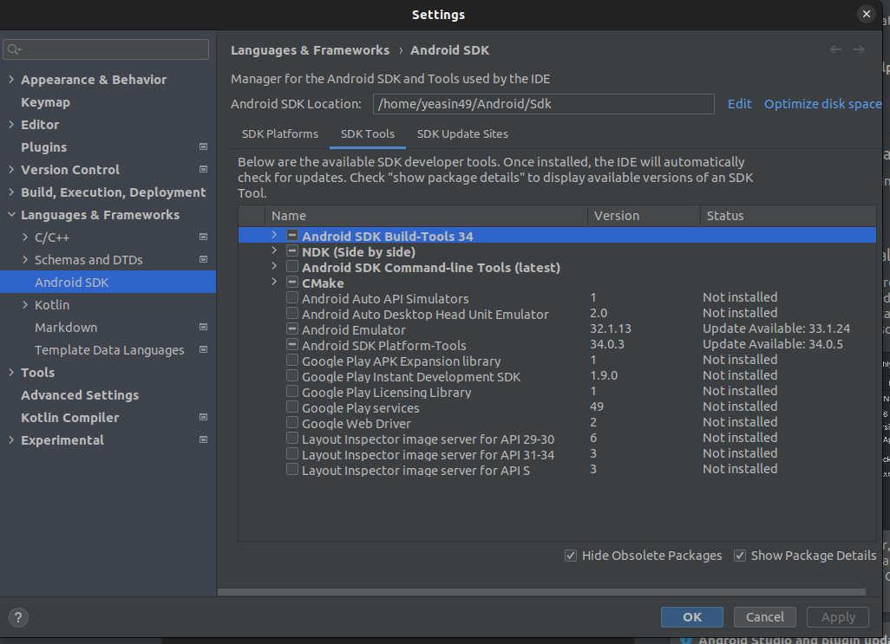
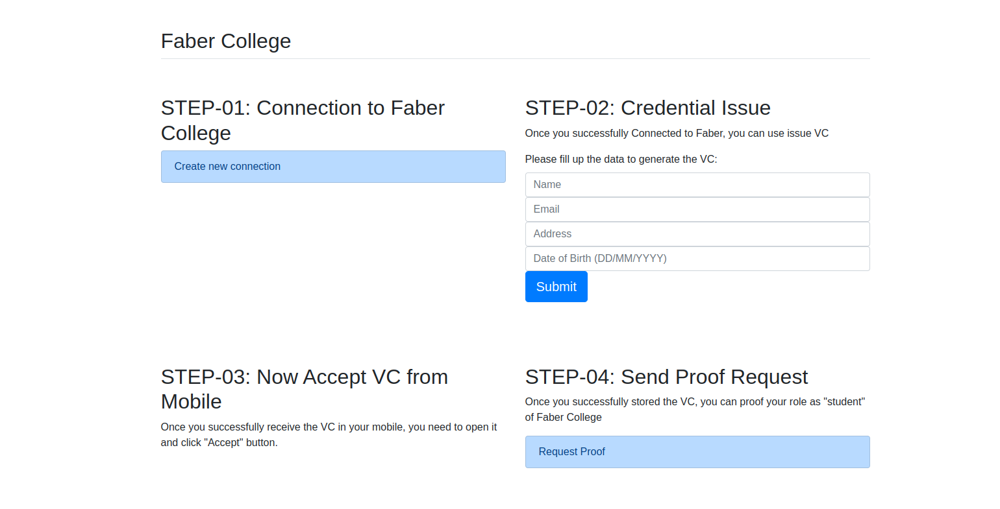
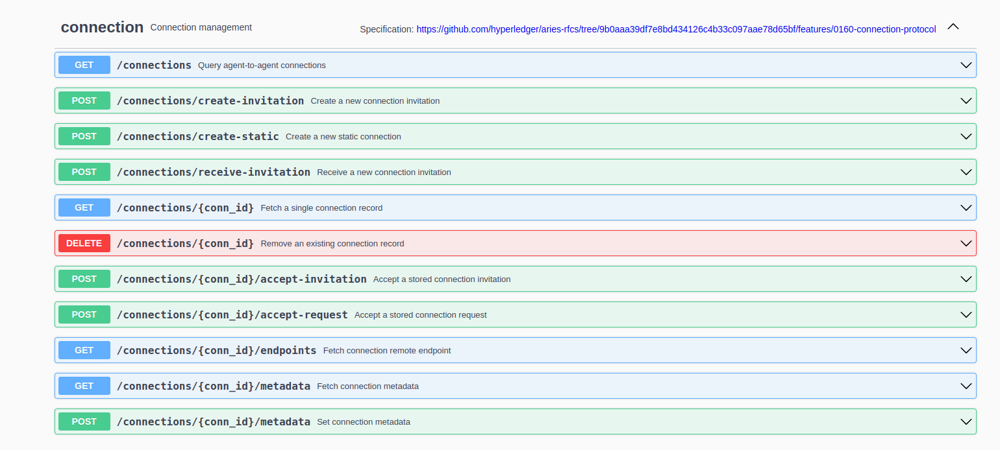
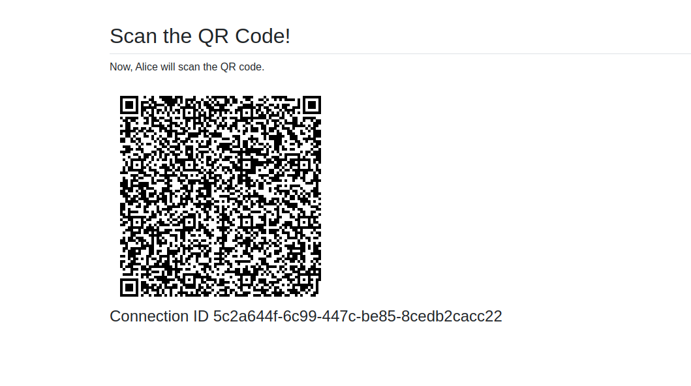

# ACA-PY Tutorial


NOTE: This tutorial was tested and Prepared using 
-   Ubuntu 22.4.0
-   Node version 16.15.0
-   python version 3.9.12
-   pip3 version 22.0
-   yarn 3.3.1
-   ACA-PY github repo release tag 0.11.0


# Section 01 - Prerequisite

## 1. Running in play with docker

The Alice/Faber demo is the (in)famous first verifiable credentials demo. Alice, a former student of Faber College ("Knowledge is Good"), connects with the College, is issued a credential about her degree and then is asked by the College for a proof. There are a variety of ways of running the demo. The easiest is in your browser using a site ("Play with VON") that let's you run docker containers without installing anything. Alternatively, you can run locally on docker (our recommendation), or using python on your local machine. Each approach is covered below.


In your browser, go to the docker playground service [Play with Docker](https://labs.play-with-docker.com/). On the title screen, click "Start". On the next screen, click (in the left menu) "+Add a new instance".  That will start up a terminal in your browser. Run the following commands to start the Faber agent:

```bash
git clone https://github.com/hyperledger/aries-cloudagent-python
cd aries-cloudagent-python/demo
LEDGER_URL=http://dev.greenlight.bcovrin.vonx.io ./run_demo faber
```

Now to start Alice's agent. Click the "+Add a new instance" button again to open another terminal session. Run the following commands to start Alice's agent:

```bash
git clone https://github.com/hyperledger/aries-cloudagent-python
cd aries-cloudagent-python/demo
LEDGER_URL=http://dev.greenlight.bcovrin.vonx.io ./run_demo alice
```

Alice's agent is now running.

Jump to the [Follow the Script](#follow-the-script) section below for further instructions.


### Follow The Script

With both the Alice and Faber agents started, go to the Faber terminal window. The Faber agent has created and displayed an invitation. Copy this invitation and paste it at the Alice prompt. The agents will connect and then show a menu of options:

Faber:

```
    (1) Issue Credential
    (2) Send Proof Request
    (3) Send Message
    (4) Create New Invitation
    (T) Toggle tracing on credential/proof exchange
    (X) Exit?
```

Alice:

```
    (3) Send Message
    (4) Input New Invitation
    (X) Exit?
```

#### Exchanging Messages

Feel free to use the "3" option to send messages back and forth between the agents. Fun, eh? Those are secure, end-to-end encrypted messages.

#### Issuing and Proving Credentials

When ready to test the credentials exchange protocols, go to the Faber prompt, enter "1" to send a credential, and then "2" to request a proof.

You don't need to do anything with Alice's agent - her agent is implemented to automatically receive credentials and respond to proof requests.

Note there is an option "2a" to initiate a connectionless proof - you can execute this option but it will only work end-to-end when connecting to Faber from a mobile agent.


## Section 02: Running on your own PC using docker
From section-01, you have an idea how aca can be used to offer the SSI features.   
Now, we will run the same demo that we did in section 01. But now it will be running in our local machine. For this follow these steps:

1. Clone the repo provided below. If you have issue cloning the github repo provided below, you can download it also. 

```shell
git clone https://github.com/hyperledger/aries-cloudagent-python
```

2. Go to ACA-PY folder using the command ```cd aries-cloudagent-python``` and prepare your laptop by installing the requirements: 

```shell
pip3 install -r demo/requirements.txt
```
3. Now, run the command to go to the demo folder: ```cd demo```

4. While in the demo folder run the command to start faber agent:

```shell
 LEDGER_URL=http://dev.greenlight.bcovrin.vonx.io ./run_demo faber
```
Acapy needs a ledger to store different data. Here we are using an indy based test public ledger for our development whcih can be found in ```http://dev.greenlight.bcovrin.vonx.io```.  
The ```./run_demo``` is a shell file which you need to study in future to understand different startup parameters need to run acapy(We will explore some parameters later). 

5. Open another console in the demo folder and issue this command to start alice: 

```shell
LEDGER_URL=http://dev.greenlight.bcovrin.vonx.io ./run_demo alice
```
6. Now, again jump to the [Follow the Script](#follow-the-script) section above for further instructions.
	
If it works, then your computer is ready for the development in full setup.

**Cheers! Take a break now. Complete the rest of the task after that. 😎**

# Section 03 -  Interact from mobile phone via controller
Till now, we used aca-py from terminal. But in real life, Faber would be a website/web based agent and Alice would be mobile based wallet agent application.  
In real life, once we run the Faber agent, it creates some API through which we use the features of aca-py. We will se how we can use these API in the upcoming section.  
however first we need a mobile based wallet agent application. For this, follow the **Setting Up Mobile Wallet** part.  

## Setting Up Mobile Wallet

### Part 1: Configuring the mobile agent

### Prerequisite
Before configuring the mobile agent, you must ensure that:
-   Android API 29.0.3 or lower. I tested the tutorial using 25 and 29. 
-   You have the android sdk build-tools version 30.0.2, 30.0.3 and 33.0.1
-   You have android sdk NDK version 21.4.7075529
**NOTE-1: Easiest way you can find and add these two tools is by installing the Android Studio Application. You can simply install it from "Ubuntu Software" store which is already installed in your computer.**   
**NOTE - 2: Since, the mobile wallet application updates frequently, you may need to keep an eye on the official github repository for prequirisites and configurations details [HERE](https://github.com/hyperledger/aries-mobile-agent-react-native/blob/main/DEVELOPER.md)**.

- After installing Android Studio, open the SDK manager and find Android SDK. From there you need to tick the specified versions and apply it.



- Next, download or clone the mobile wallet application that we will use from [Here](https://github.com/hyperledger/aries-mobile-agent-react-native) 

```
git clone https://github.com/hyperledger/aries-mobile-agent-react-native
```

-   In addition you need to set the environment path for anrdoid [[Check Docs](https://developer.android.com/tools/variables#set) ]. Or alternative inside the ```ries-mobile-agent-react-native``` folder you can create a file inside the ```packages>legacy>app>android``` and name it ```local.properties``` and paste the android sdk folder path (```sdk.dir```) in the mentioned format below. 


```shell
sdk.dir = YOUR_PATH_TO_ANDROID_SDK_FOLDER
```

* You may check this official documentation [developer.md](https://github.com/hyperledger/aries-mobile-agent-react-native/blob/main/DEVELOPER.md). 

**NOTE:** After you download or clone the aries-mobile-agent-react-native you need to do the following:   
1. Check the ```Aries Mobile Agent Config``` folder in this repo and you will find there is a folder called: ```Aries Mobile Agent Config```. Within this folder, there are three things: a folder named ```bcovrin-test-net```, a file called ```index.js``` and another file called ```AgentService.js```. 

2. Paste the ```bcovrin-test-net``` folder inside the ```packages/legacy/core/configs/ledgers/indy``` folder of the ```Aries Mobile Agent React Native``` codebase. 

3. Also, copy content of ```index.js``` file from ```Aries Mobile Agent Config``` and paste it into the ```index.ts``` file within the ```packages/legacy/core/configs/ledgers/indy``` folder of the ```Aries Mobile Agent React Native``` codebase. While pasting it into the ```index.ts``` file remove the previous content of ```index.ts``` file.

4. from the terminal go to the aries-mobile-agent-react-native folder and run:
```shell
yarn install
```

5. Some packages need to be built (transpiled) before they can be used from the app. Do this with the following command:
```
yarn run build
```
NOTE: On a certain point of installation or build process, this may take a lot of time and you may think the terminal is freezed. But keep patience, this should be successful after that.

6. Now, in the ```packages/legacy/app``` folder create a file named as ```.env``` and paste the code provided below inside that file:

```
MEDIATOR_URL=https://public.mediator.indiciotech.io?c_i=eyJAdHlwZSI6ICJkaWQ6c292OkJ6Q2JzTlloTXJqSGlxWkRUVUFTSGc7c3BlYy9jb25uZWN0aW9ucy8xLjAvaW52aXRhdGlvbiIsICJAaWQiOiAiMDVlYzM5NDItYTEyOS00YWE3LWEzZDQtYTJmNDgwYzNjZThhIiwgInNlcnZpY2VFbmRwb2ludCI6ICJodHRwczovL3B1YmxpYy5tZWRpYXRvci5pbmRpY2lvdGVjaC5pbyIsICJyZWNpcGllbnRLZXlzIjogWyJDc2dIQVpxSktuWlRmc3h0MmRIR3JjN3U2M3ljeFlEZ25RdEZMeFhpeDIzYiJdLCAibGFiZWwiOiAiSW5kaWNpbyBQdWJsaWMgTWVkaWF0b3IifQ==
```
The above link is the mediator we will be using. You need to learn about the mediator in future. We will not discuss it here. You can check official documentation for this later from here: [Aca-py mediation](https://github.com/hyperledger/aries-cloudagent-python/blob/main/Mediation.md) 

#### Building the app in smartphone

Now, we need to build the application in our mobile. We will use real mobile device instead of using the mobile emulator. Make sure your device has the "Developer Option" enable and "USB Debugging" option is turned on.

_**Note:** bundling and installling the app in your mobile device require only one attempt. Once the app installed in your mobile you can use it in future without bundling again. However, if you update mobile agent code you need to build it again._


1. First, plug in your mobile into your computer using a USB cable. Initially in the notification panel you will see chargin option. Tap it and change it to "File Transfer" mode. Next, run the command mentioned below to check whether your mobile is connected or not:
```shell
adb devices
```

After running the command if you see something link below, you can skip step 2 and 3.
```shell
List of devices attached
57396ee8	device

```
Here, 57396ee8 is my connected mobile.

If you do not see conencted device, follow from step 2.

2. run the command : ```lsusb```. This will print something like below:

```shell
Bus 002 Device 001: ID 1d6b:0003 Linux Foundation 3.0 root hub
Bus 001 Device 004: ID 13d3:3496 IMC Networks 
Bus 001 Device 003: ID 13d3:5a01 IMC Networks USB2.0 VGA UVC WebCam
Bus 001 Device 002: ID 0bda:0129 Realtek Semiconductor Corp. RTS5129 Card Reader Controller
Bus 001 Device 005: ID 2717:ff08 Xiaomi Inc. Redmi Note 3 (ADB Interface)
Bus 001 Device 001: ID 1d6b:0002 Linux Foundation 2.0 root hub
```

Here, ```us 001 Device 005: ID 2717:ff08 Xiaomi Inc. Redmi Note 9s (ADB Interface)``` is my mobile connected via USB cable.

You need the data that represents your phone. If you're in doubt, try unplugging your phone and running the command again.

From the above line, you need to grab the first four digits from the device ID. For my case, the ID is: ```2717:ff08```. Therefore, the first four digits are: ```2717```


3. Now, run the command below:

```shell
echo 'SUBSYSTEM=="usb", ATTR{idVendor}=="REPLACE_BY_4_DIGITS_OF_YOUR_DEVICE", MODE="0666", GROUP="plugdev"' | sudo tee /etc/udev/rules.d/51-android-usb.rules
```

Make sure that you replace _4_DIGITS_OF_YOUR_DEVICE_ with the identifier you get in the above command.

Now, run the command: ```adb devices```. If you do this correctly, you should see a device connected now similar to :

```shell
List of devices attached
57396ee8	device
```

#### * Running metro and building
1. Open the terminal and make sure your current terminal path is pointing the ```packages/legacy/app``` folder. Now Run:
```shell
yarn start
```
or if you do not have yarn:
```shell
npm start
```

This will start the metro which is a react native packager.

2. Open a new terminal and again go to the same terminal path ``packages/legacy/app``` and run:

```shell
yarn run android
```
or if you do not have yarn:
```shell
npm run android
```

This will build an apk file to your android device.


**Note:** Have a look at these two pages later: 
* [Official Readme.md](https://github.com/hyperledger/aries-mobile-agent-react-native), 
* [developer.md](https://github.com/hyperledger/aries-mobile-agent-react-native/blob/main/DEVELOPER.md). 
 

# Section 04: Controller API 
In last sections, we saw how we can create invitation, issue VC and request proof and verify VC. All of these we did were from terminal. But how it is happening ? 

Aca-py is basically just a service we call it agent. When it gets started, it also creates some API for us. All the feature from the terminal we used are basically done by calling those APIs. For an analogy, consider Aca-py is a tea and coffee vending machine. If you want tee, you simply press a ```BUTTON``` as a call to the vending machine, and it will prepare and deliver you a cup of tea. If you need coffee, you will press another ```BUTTON``` as a call to vending machine and it will prepare and deliver you with a cup of coffee. Therefore, acapy has the built in functions for connections, Issueing VC, Proofing VC. It provides you a ```BUTTON``` through which you will call it and use those features, and this ```BUTTON``` is basically the Agent API aka Controller API of acapy.

Therefore, we need a web server from where we will call and use those APIs and this web server is called a controller. You can think it like a backend server that uses and calls APIs provided by aca-py. Therefore we will create a web server from where we will use connectoin, VC and proof API of acapy.

1. You will find a folder called controller in this github repository. download or clone it to your computer.
2. Once you download it, from the terminal go to the ```cd controller``` and run:
 ```shell
 npm install
 ```
3. there is a ```views``` this are basically the files which we will render and show to users from the browser. ```server.js``` is the main file where we will write our code. You will see I already indicated from where you have to write your code like below:
```javascript
const express = require('express')
const bodyParser = require('body-parser')
const qr = require("qrcode");
const axios = require('axios');
require('dotenv').config() 

// setting global attributes
var connectionId = null;
var retrievedAttribute = null;

// initiating the express js
const app = express()

// setting up the server side render engine  
app.set("view engine", "ejs");

// setting up various parsers
app.use(bodyParser.urlencoded({ extended: false }));
app.use(bodyParser.json())
/*************************************************************
 *  ALL OF YOUR API SHOULD BE WRITTEN BELOW THIS LINE
*************************************************************/


// YOU WILL WRITE CODE BETWEEN IN THIS AREA


/*************************************************************
 *  ALL OF YOUR API SHOULD BE ABOVE THIS LINE
*************************************************************/
app.listen(9999, () => {
	console.log('Server up at 9999')
	// global.connectionId = "44baf04c-911d-4191-9e84-e115c9101ec6"
})
```

Now, copy the code provided below and paste it inside the mentioned code are of ```server.js``` file.
```js
// Simple routing to the index.ejs file
app.get("/", (req, res) => {
    res.render("index");
})
```
This is just a simple route which brings the index.ejs page to the client in the browser.

Now, if you run ```npm start``` in your terminal, you will see a browser page like below:



**_NOTE:The Complete Application cannot be used untill the end of Section 04. Therefore, you will see things in browser but since we still did not start our agent, it is not functional_**


Now your server is ready and you need to understand some concept. When we start an agent, for example Faber, it runs like a server in a your localhost url. Now for our case, when we will run it in ```http://localhost:8020``` and the agent provide us some API in http://localhost:8021. You can check these API simply entering the url in your browser and you can even call those api from there. There is another url which is required for webhook events. To transfer data in different situation, acapy utilizes webhook and for this we need to use another url. For our case, we will use the url of our controler with a route endpoint ```/webhooks```. The the full url is ```http://localhost:9999/webhooks```. We will see more of this gradually.


### Feature - 1: Connection
-----------------------------------------
In acapy, first, we need to establish a connection between agents. In our case, we will connect Faber agent with our mobile based wallet agent. So what is the API through which we can utilise features related to connections ?
The answer is, you can visit http://localhost:8020 from the browser and you will see multiple APIs related to Connections features are available.



Now for our case we will use the API code written below:
```js
// create an invitation for establishing connection
app.get('/newConnection', async (req, res) => {
	try {
		connectionId = null
		const resp = await axios.post('http://localhost:8021/connections/create-invitation')
			if (resp) {
				const connectionID = resp.data['connection_id']
				const inviteURL = JSON.stringify(resp.data['invitation_url'], null, 4);
				qr.toDataURL(inviteURL, (err, src) => {
					// passing the data to invitation.ejs page to show QR Code
					console.log({src})
					res.render("invitationQr", { src, connectionID });
				});
			}
            else{
				res.render("index", {message: "API service unavailable"})
			}
	} catch (err) {
		console.log("Filed to generate invitation")
		console.error( err )
	}
})
```
Here ```/newConnection``` is the path we created so that users, can call this from the browser and we can then utilise API of acapy. Now, notice we had a POST call to this url: ```http://localhost:8021/connections/create-invitation'``` This is the API url endpoint which is provided by acapy to generate invitation data for establishing a new connection. So, if you want to use other APIs use can use it from ```http://localhost:8021``` base url. Now, copy the above code and paste it inside the designated area in ```server.js``` file. When we  finish Section 04, if you follow Step 1 from the home page of our application, you will see once you click ```Create new connection``` button, it will show you a QR code to scan like below.



**_NOTE:The Complete Application cannot be used untill the end of Section 04. Therefore, if you want to access QR code right now it give you error since we still did not start our agent and that's why it is not functional yet_**

Next, we need to prepare somethign, so that when we scan from mobile based wallet agent, we can receive the request from our controller. For this copye the code below and paste it in ```server.js```  

```js
// receive webhook events upon state changes
app.post("/webhooks/*", (req, res, next) => {
	try {
		console.log("==================== webhook data ==================")
		console.log(req.body)
		console.log("==================== webhook data ==================")
		const conID = req.body['connection_id']
		const conStatus = req.body['rfc23_state']
		if(conID){
			// Connection complete
			if(conStatus === "completed"){
				console.log("=========== Connected Successful ============")
				connectionId = conID
			}
			// Credential accepted by user from mobile
			if(req.body['state'] === 'credential_acked'){
				console.log("=========== Credential acknowledged by user ============")
			}
			// Proof request approved by user from mobile
			if(req.body.state === "presentation_received"){
				const revealed_role = req.body?.presentation?.requested_proof?.revealed_attrs['vc_role']?.raw ?? undefined
				console.log("=========== Role Proved ===========")
				retrievedAttribute = revealed_role
			}
		}
		res.writeHead(200, {'Content-Type': 'text/plain'});
		res.end('Event Receied\n');
	} catch ( err ) {
		console.error( err )
	}
})
```
Whenever, acapy sends some webhook events, we can receive this from our controller's from ```http://localhost:9999/webhooks/```. In the code provided above contains webhooks events and for threee different cases we are using it such as connection cration, VC issuance and proof event.

Finally, from the QR code page, we need to find out whether the connection successfully established or not. For this paste the code inside ```server,js``` :
```js
// fetching connection status
app.get("/status", (req, res) => {
	res.writeHead(200, {'Content-Type': 'text/plain'});
	if(!connectionId) {
		res.end("Not connected")
		return
	}
    res.end(`${ true }`);
})
```


Now, you can scan QR code from the mobile wallet and will see how a connection gets created. Once a conenction creates, you will be able to see the name on ```contacts``` option in the mobile wallet menu.


### Feature - 2: Issue Credential
-----------------------------------------
in this tutorial, Faber is the issuer who will issue VC to its students. In a VC, Fabel College provides some information of student such as  "name", "email", "address", "birthdate_dateint", "role", "timestamp". In acapy these are basically the ```Schema```. Later when we start our acapy agent, you will see in the terminal that the Faber agent generate schema at when it getting started. Now, open the ```faber.py``` file(you will find it inside ```demo/runners/``` folder) and search for something like below:
```python
faber_schema_name = "degree schema"
faber_schema_attrs = [
    "name",
    "date",
    "degree",
    "birthdate_dateint",
    "timestamp",
]
```
The is the default schema provided in the faber demo application. We will modify it. Now replace this using the schema provided below:
```python
faber_schema_name = "Faber College schema"
faber_schema_attrs = [
    "name",
    "email",
    "address",
    "birthdate_dateint",
    "role",
    "timestamp",
]
```

Now, copy and paste the code in ```server.js```
```js

// Offer a VC
app.post('/offerCredential', async function(req,res) {
	try {
		const name = req.body.name
		const email = req.body.email
		const address = req.body.address
		const date = req.body.dob
	
		// fetching the Credential Definition
		const resp = await axios.get('http://127.0.0.1:8021/credential-definitions/created')
		
		// if not found end response
		if(!resp){
			res.end("API service unavailable")
			return 
		}

		const credID = resp.data['credential_definition_ids'][0];
		console.log("Credential ID : " + credID)
		if(credID){
			const data = {
				"auto_issue": true,
				"auto_remove": true,
				"connection_id": connectionId,
				"cred_def_id": credID,
				"comment":"Offer on cred def id " + credID,
				"credential_preview":{
					"@type":"https://didcomm.org/issue-credential/1.0/credential-preview",
					"attributes":[
						{
							"name":"name",
							"value":name
						},
						{
							"name":"email",
							"value":email
						},
						{
							"name":"address",
							"value":address
						},
						{
							"name":"birthdate_dateint",
							"value":date
						},
						{
							"name":"role",
							"value":"student"
						},
						{
							"name":"timestamp",
							"value": ""+Date.now()
						}
					]
				}
			};
			const result = await axios.post('http://127.0.0.1:8021/issue-credential/send-offer', data)
			res.render("index", { message: "VC sent. You will receive it soon....." })
		}
		
	} catch ( err ) {
		console.log( err )
	}
});
```
To offer a VC, a Credential Definition is required. In the above we first retrieve the Credential Definition of the agent an then by using it we send the VC offer.

### Feature - 3: Proof Request
-----------------------------------------
Now, we need to prove the VC that we receive in the mobile wallet.
```js

// requesting user to proof VC
app.get('/proofReq', async function(req,res) {
	try {
		// search for matching credential definition
		const resp = await axios.get('http://127.0.0.1:8021/credential-definitions/created')
		if( !resp ){
			res.end("Controller API service unavailable")
			return
		}

		const credID = resp.data['credential_definition_ids'][0];
		if(connectionId){
			const data = {
				"connection_id": connectionId,
				"proof_request": {
					"name": "Proof of Role",
					"version": "1.0",
					"requested_attributes": {
						"vc_role": {
							"name": "role",
							"restrictions": [
								{
									"schema_name": "Faber College schema",
									"cred_def_id": credID
								}
							]
						}
					},
					"requested_predicates": {
						// You need to explore about predicates later
					}
				}
			}; 
			// request holder for a proof request
			await axios.post('http://127.0.0.1:8021/present-proof/send-request', data)
			res.render("index", { message: "Proof Request Sent. You will receive it soon....." })
		}
	
	} catch ( err ) {
		console.error( err )
	}
});

```

In the API above, we first retrieved the Credential Definition that the agent uses and then send a proof request to user's mobile wallet.

So once user receives a proof request and press "share" button from the mobile wallet, the controller will receive webhook events from ```/webhooks``` route we provided earlier. There you will find code  about how we retrieve the VC data shared from the user's mobile wallet. Once the proof process is done from the moble. Now you just need to follow Step 5 from the browser and You will see an alert box will show you that you are a student f Faber College. 
But stil now we didn't start the agent so it is not functional yet.

Now, copy the code below, and paste it inside ```servr.js```
```js
app.get("/checkRole", (req, res)=>{
	res.render("index", { message: "Proof Successful, You are: "+ retrievedAttribute + " of Faber College" })
})
```
Thsi route will simply send the ```role``` attribute of VC to the browser to show it to users.

## Section 05: Running the agent using ngrok
---------------------

In section 4, we discussed that our agent will start on ```http://localhost:8020``` also the controller is running on ```http://localhost:9999```. Localhost is accessiblejust from you local network. **But How the mobile based wallet agent application will find the Agent and Controller url since the mobile wallet is not running on local network ?**

**To answer in one sentence, we need a Public IP/Public Url address**

So in this case, ngrok helps us regarding the issue. ngrok's feature will turn our localhost address into a publicly available url.Ngrok basicall maps the localhost domain into a publicly accessible domain. 


So first, install ngrok using the command:

```shell
curl -s https://ngrok-agent.s3.amazonaws.com/ngrok.asc | sudo tee /etc/apt/trusted.gpg.d/ngrok.asc >/dev/null && echo "deb https://ngrok-agent.s3.amazonaws.com buster main" | sudo tee /etc/apt/sources.list.d/ngrok.list && sudo apt update && sudo apt install ngrok
```
7. After installing, add auth token by running the command: 
```shell
ngrok config add-authtoken REPLACE_THIS_WORD_BY_A_RANDOM_TOKEN
```
This command, will create a config file called ```ngrok.yml``` in your ```Home/.config/ngrok```. Make sure, you are viewing the hidden files inside ```Home``` folder because the ```.config``` file is a hidden file.

**NOTE:** Depending on the ubuntu version and distribution and also the way you install it, the location of the ngrok.yml file may vary. Therefore, if you don't find the file, try searching it from the terminal. I am using ubuntu v22.4.0.

8. Now, copy the content below and paste it to the mentioned ```ngrok.yml``` file
```yml
version: "2"
authtoken: REPLACE_THIS_WORD_BY_THE_TOKEN_YOU_ENTERED_EARLIER
tunnels:
    first:
        addr: 8020
        proto: http
    second:
        addr: 9999
        proto: http
```
Finally, you are done configuring the ACA-PY. Now we can run our whole application.


### 1. Run ngrok tunnel

1. First, we will start the tunnel using ngrok:
```shell
ngrok start --all
```

After running the command you should see something like below: 

```shell
ngrok                                                                                    (Ctrl+C to quit)
                                                                                                         
Want to improve ngrok? Take our survey:  https://ngrok.com/survey                                        
                                                                                                         
Session Status                online                                                                     
Account                       Yeasin (Plan: Free)                                                        
Version                       3.1.1                                                                      
Region                        India (in)                                                                 
Latency                       -                                                                          
Web Interface                 http://127.0.0.1:4040                                                      
Forwarding                    https://1d54-103-110-217-248.in.ngrok.io -> http://localhost:9999          
Forwarding                    https://eb87-103-110-217-248.in.ngrok.io -> http://localhost:8020          
                                                                                                         
Connections                   ttl     opn     rt1     rt5     p50     p90                                
                              0       0       0.00    0.00    0.00    0.00  
```

### 2. Run Controller
------------------------------------------
Open a terminal from the controller folder and run 
```shell
npm start
```
This will start your controller.


### 3. Run Faber Agent
Open another terminal tab and make sure the current terminal path is inside ```aries-cloudagent-python/demo/```. Now you need to replace some of the value from the command and run it.
```shell
LEDGER_URL=http://dev.greenlight.bcovrin.vonx.io AGENT_ENDPOINT=https://eb87-103-110-217-248.in.ngrok.io WEBHOOK_URL=1d54-103-110-217-248.in.ngrok.io/webhooks ./run_demo faber --webhook-url
```
Lets break it down, here ```AGENT_ENDPOINT``` is the ngrok url for ```http://localhost:8020```. ```WEBHOOK_URL``` is the ngrok url of ```http://localhost:9999```. **NOTICE, we removed _https_ part from the url since it will be added by the run_demo file itself when we run it. Also notice, at the end the url we added ```/webhooks``` keyword.** Now, replace these two values with your own value avail in the running ngrok terminal session.


This will take few minutes and should run faber and show a QR code to the terminal. You may see this video provided in this repo to understand, How the process works.

### How to proceed further ?
---------------------------------------------
Remember the faber-alice demo is not acapy. It is just a demo application to learn acapy at the beginning. There is a folder called ```aries-cloudagent-python```, this is the main code base of acapy. You can run it which is more customizeable. There is a ```scripts``` folde where there is a file callled ```run_docker``` you can utilize it to run a fresh version of acapy. Another alternative is tp use aca-py python package. To learn more you must follow official documention. 

Link: 
- Official Docs: https://github.com/hyperledger/aries-cloudagent-python/blob/main/docs/GettingStartedAriesDev/README.md

- Github Repository: https://github.com/hyperledger/aries-cloudagent-python
- Faber Alice Demo https://github.com/hyperledger/aries-cloudagent-python/demo


